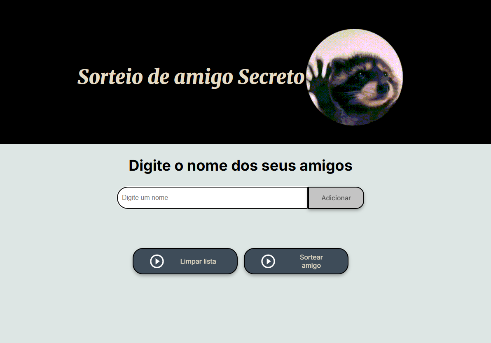
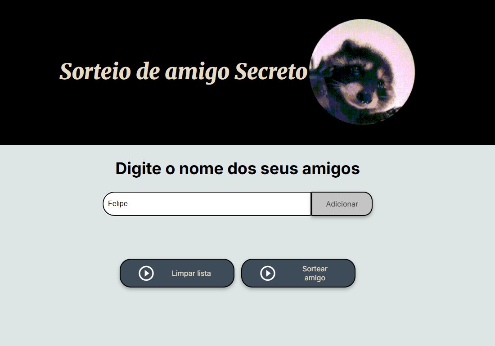
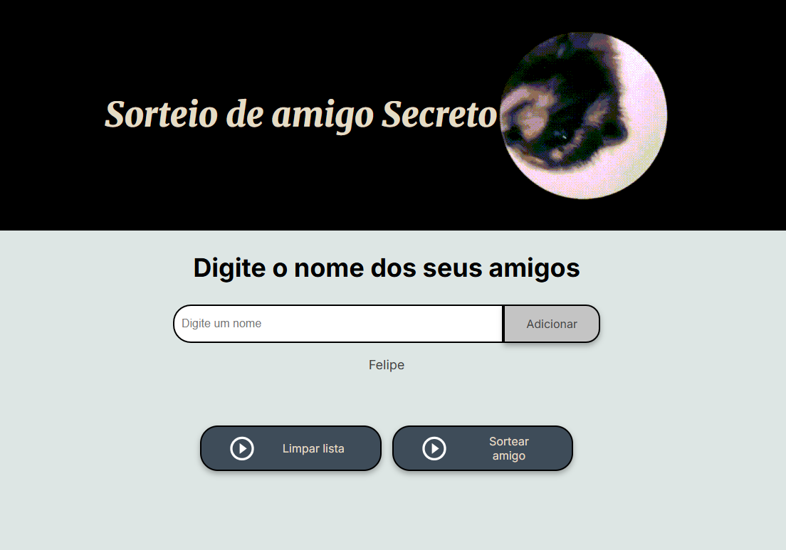
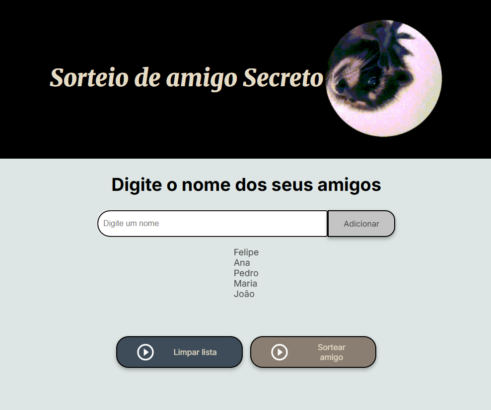
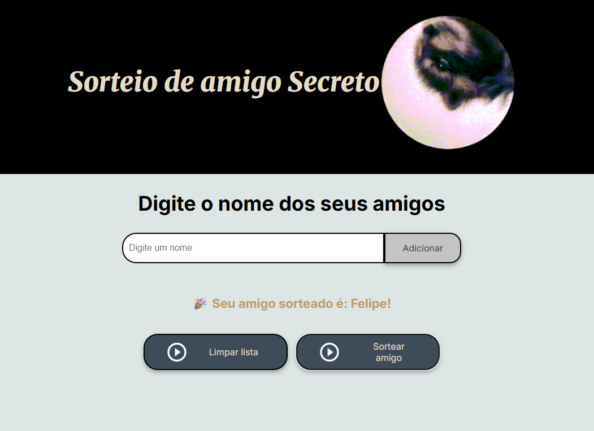

<h6 align="center">Este README foi criado com a ajuda de uma IA, pois o criador ainda está aprendendo a criar documentos README</h6>

<h1 align="center">🎯 Challenge Amigo Secreto (ONE)</h1>

---

## 📌 Sobre o projeto

Projeto desenvolvido para o primeiro Challenge do programa ONE (Oracle Next Education) oferecido pela Alura.

  Proposta do projeto:

- Adicionar nomes a uma lista (sem repetições)
- Sortear aleatoriamente **um amigo secreto** a partir da lista
- Exibir os nomes adicionados
- Limpar a lista com um clique
- (E ainda possui um Easter egg)

---

🧾 Licença

Este projeto foi desenvolvido para fins educacionais e pessoais.
Sinta-se à vontade para estudar, modificar e adaptar como quiser.

---

## 🧑‍💻 Como usar

1. Digite o nome de um amigo no campo de entrada.
2. Clique no botão **Adicionar** para incluí-lo na lista.
3. Após adicionar todos os amigos, clique em **Sortear amigo** para sortear um nome aleatório.
4. Use o botão **Limpar lista** para remover todos os nomes e recomeçar o sorteio.

---

## 🛠️ Tecnologias utilizadas

- **HTML5** – Estrutura semântica da página
- **CSS3** – Estilização moderna com variáveis e flexbox
- **JavaScript (Vanilla)** – Manipulação do DOM, eventos, lógica de sorteio
- **Google Fonts** – Fontes Inter e Merriweather para uma tipografia agradável
- **Mídias interativas** – Uso de imagem .gif e áudio .mp3

---

## 💡 Recursos especiais

-  Lista dinâmica dos nomes
-  Validação para evitar nomes vazios ou repetidos
-  Sorteio aleatório de um nome
-  Botão para **limpar a lista** sem precisar recarregar a página
-  **Um Guaxinim girando** "mascote do projeto 🦝"
-  Easter egg ao adicionar um nome específico 🧐

---

## 🖥️ UTILIZANDO EM SEU COMPUTADOR

1. Clone o repositório:
   ```bash
   git clone git@github.com:Felpsz-Brucciamolino/Challenge-Amigo-Secreto.git

2. Acesse a pasta do projeto:
    ```bash
    cd Challenge-Amigo-Secreto

3. Abra o arquivo index.html no seu navegador.
  💡 Este projeto não requer nenhum tipo de instalação — apenas abra o arquivo HTML pelo navegador de sua escolha.


---

## 📷 Demonstração do PROJETO

<p align="center">      </p>
